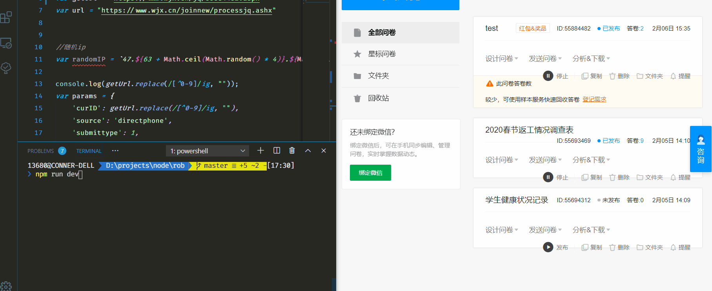

# auto questionnaire


### DESCRIPTION
一个用于自动填写问卷星的问卷的工具。

---
### HOW TO USE
- 修改[index.js](./index.js)中的getUrl
- 在[your_config.json](./your_config.json)下修改你的信息
- 运行程序
```
npm install
npm run dev
```
- 查看运行结果
  - 如果控制台上的结果为`10〒/wjx/join/complete.aspx?q=55693469&JoinID=103917325529&jidx=9`，则已经正确提交
  - 如果控制台上的结果为`2〒很抱歉，有异常发生，您刚才填写的答卷没有正常提交，请尝试重新提交或者刷新页面再重新填写`,说明提交错误
---

憨憨代码，希望各位观众姥爷不要见怪，若大佬发现bug或者运行错误之后多提issue(●ˇ∀ˇ●)

--- 
### 参数说明
formdata为所提交的表单数据,数据的内容格式为 [题号]+'$'+[答案]+')'
params用于验证信息


---

### RESULT


---

### TODO
- [ ] 添加定时功能

